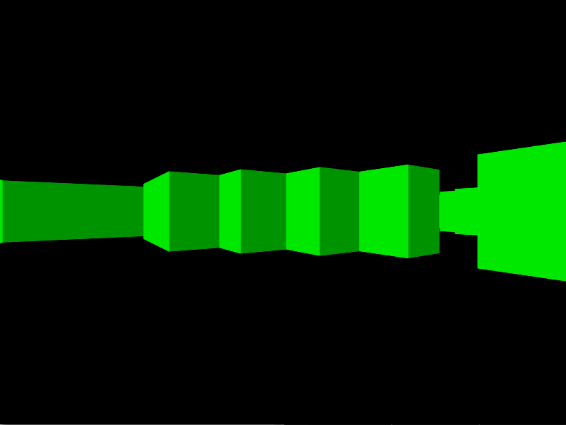

# Lua Raycasting Engine

A first attempt at making a raycasting engine myself, using Lua and the LÖVE framework.

The engine is currently untextured and looks like the screenshot below.

### Links

Inspired by and following [Lode's raycasting tutorial](https://lodev.org/cgtutor/raycasting.html).
